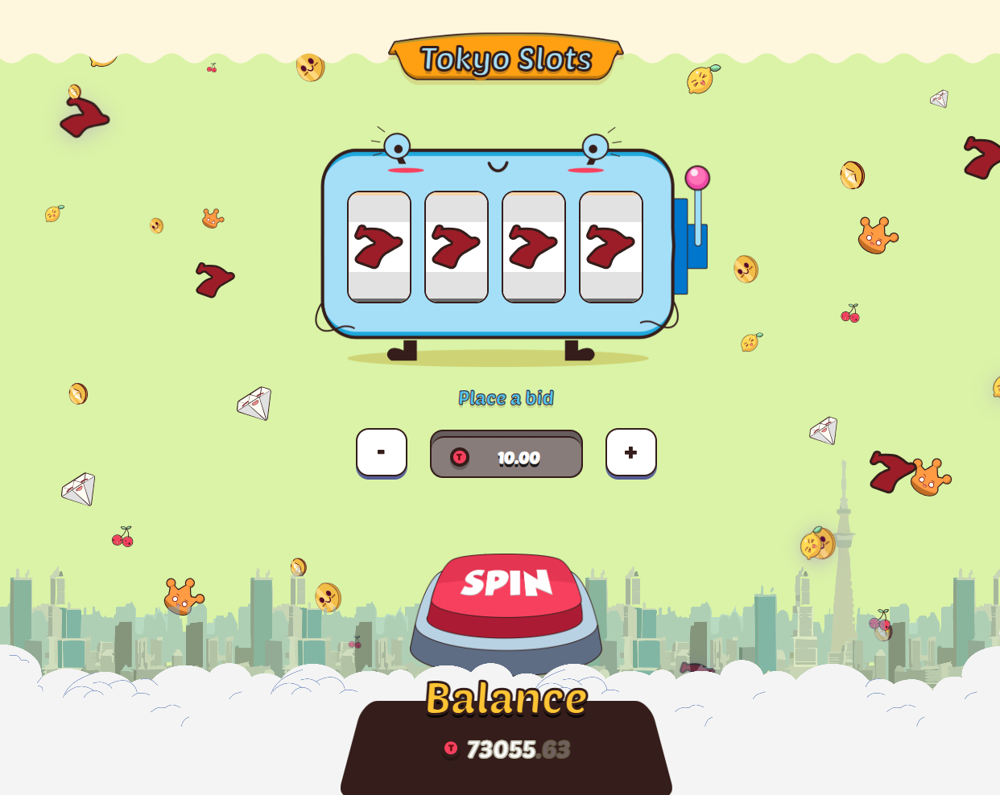

# 🎰 Tokyo Slots

> Experience the thrill of a classic slot machine game with a vibrant Tokyo theme and modern web technology.

**Tokyo Slots** is a fully-featured, interactive 4-reel slot machine game built with modern web technologies. Step into the neon-lit streets of Tokyo and test your luck! With smooth animations, immersive sound effects, and engaging gameplay mechanics, this project demonstrates best practices in React game development.

### 🎮 Play Now

- Demo: [Watch gameplay demo](https://tokyo-slots-pi.vercel.app/)

### 📸 Preview



## Game Overview

Tokyo Slots is a classic 4-reel slot machine game with a Tokyo theme. The objective is to match symbols across the reels to win prizes based on the paytable. The more symbols you match, the higher your reward.

### How to Play

1. Set your bet amount using the bet controls
2. Pull the slot machine lever or click the spin button
3. Watch the reels spin
4. Match 2, 3, or 4 identical symbols to win!
5. 4 matching **Seven** symbols = Jackpot!

### Paytable (Win Multipliers)

| Symbol        | 2 Match | 3 Match | 4 Match    |
| ------------- | ------- | ------- | ---------- |
| 🔱 Seven      | 2x      | 12x     | **50x** ⭐ |
| 👑 Crown      | 1.8x    | 8x      | 20x        |
| 💎 Diamant    | 1.6x    | 6x      | 15x        |
| 🍒 Cherry     | 1.4x    | 5x      | 12x        |
| 🍋 Lemon      | 1.3x    | 4x      | 10x        |
| ¢ Cent        | 1.2x    | 3x      | 8x         |
| 😊 Smile Cent | 1.2x    | 3x      | 8x         |

**Jackpot**: Get 4 matching **Seven** symbols to trigger the jackpot for massive winnings!

## ✨ Key Features

- 🎰 **Animated 4-Reel Machine** — Smooth, performant animations with custom Tokyo-themed icons
- 🎯 **Smart Bet System** — Intuitive bet controls with balance-aware min/max clamping
- 🏆 **Dynamic Win Logic** — Calculate payouts based on symbol matches (2, 3, or 4 reels)
- 💰 **Jackpot Mechanics** — Trigger massive rewards with 4 matching Seven symbols
- 🔊 **Immersive Audio** — Full sound design for spins, wins, losses, and jackpot celebrations
- 📱 **Responsive Design** — Seamless gameplay on desktop, tablet, and mobile devices
- 💾 **Persistent State** — Your balance is saved in localStorage between sessions
- ✨ **Visual Effects** — Full-screen animated sun popup with rotating rays
- ⚡ **High Performance** — Built with Vite for lightning-fast load times

## 🛠️ Tech Stack

| Technology         | Purpose                                            |
| ------------------ | -------------------------------------------------- |
| **React**          | Component-based UI with hooks for state management |
| **TypeScript**     | Type-safe development with excellent IDE support   |
| **Vite**           | Ultra-fast build tool and dev server               |
| **Zustand**        | Lightweight global state management for game logic |
| **Tailwind CSS**   | Utility-first styling for responsive design        |
| **CSS Animations** | Custom keyframe animations for reels and effects   |

## 🚀 Getting Started

### Prerequisites

- Node.js 16+
- npm or yarn

### Installation & Development

```bash
# Clone or navigate to project directory
cd tokyo-slots

# Install dependencies
npm install

# Start development server
npm run dev
```

Open your browser and navigate to `http://localhost:5173` (or the URL shown in terminal).

### Production Build

```bash
# Build for production
npm run build

# Preview production build locally
npm run preview
```

The optimized bundle will be in the `dist/` directory.

## 📂 Project Structure

```
src/
├── components/               # React components
│   ├── Slots/               # Main slot machine component
│   ├── SpinButton/          # Lever/spin trigger
│   ├── BetCount/            # Bet amount controls
│   ├── Header/              # Game title & info
│   ├── Footer/              # Game footer
│   ├── FloatIcon/           # Floating decorative elements
│   └── SunPopup/            # Animated win popup with sun rays
│
├── store/                   # Zustand state management
│   ├── useGameStore.ts      # Main game state & actions
│   ├── gameWinLogic.ts      # Payout calculation engine
│   ├── gameConfig.ts        # Game constants & config
│   └── gameTypes.ts         # TypeScript type definitions
│
├── hooks/                   # Custom React hooks
│   └── useSound.ts          # Sound effect management
│
├── utils/                   # Utility functions
│   └── parseBalanceParts.ts # Balance formatting
│
├── assets/                  # Images, icons, sounds
│   ├── floatIcons/         # Slot machine symbols
│   └── sound/              # Audio files
│
└── App.tsx                 # Root component
```

## 🎓 Learning & Development

This project showcases several important concepts in modern web development:

- **State Management**: Using Zustand for game state without Redux boilerplate
- **Game Logic**: Implementing payout calculations and win detection
- **Performance**: Leveraging React hooks and memoization for smooth gameplay
- **Responsive Design**: Mobile-first approach with Tailwind CSS
- **Audio Integration**: Web Audio API for dynamic sound effects
- **Animations**: CSS keyframes and transforms for engaging visuals

## 🤝 Contributing

Want to add features or improve the game? Contributions are welcome!

1. Fork the repository
2. Create a feature branch (`git checkout -b feature/AmazingFeature`)
3. Commit your changes (`git commit -m 'Add AmazingFeature'`)
4. Push to the branch (`git push origin feature/AmazingFeature`)
5. Open a Pull Request

## 📄 License

This project is open source and available under the MIT License.

## 🎮 Enjoy the Game

Good luck and have fun spinning! May the Seven be with you! 🍀✨
